# Decent ERP - Design Management

Production-ready Next.js full-stack application for textile design operations: concepts, task workflows, time tracking, approvals, costing, production release, KPI, and admin masters - with PostgreSQL, Redis, MinIO, and RBAC.

## Stack

| Layer | Technology |
|---|---|
| App | **Next.js 16.3** (App Router, Route Handlers, standalone Docker output) |
| Database | **PostgreSQL 16** + **Prisma 6** |
| Auth | **NextAuth v5** (JWT) + role-based permissions |
| Queue | **Redis 7** + **BullMQ** (notification worker) |
| Files | **MinIO** (S3-compatible) for design images |
| UI state | **TanStack Query** |
| Charts | **Recharts** (KPI dashboards) |
| Tests | **Vitest** + GitHub Actions CI |

---

## Quick start (local)

If ports **5432**, **6379**, or **9000** are already in use, the default `.env.example` uses **5433**, **6380**, and **9002** - no changes needed.

```bash
cp .env.example .env
docker compose up postgres redis minio minio-init -d
npm install
npm run db:migrate
npm run db:seed
npm run dev
```

Open **http://localhost:3000** and sign in as System Admin:

| Field | Value |
|---|---|
| Email | `admin@decent-erp.local` |
| Password | `Admin@123` |

Optional background worker (email/in-app notifications via BullMQ):

```bash
npm run worker
```

### Production build (local)

On Windows, a running `dev` server locks Prisma's query engine DLL and causes `EPERM` during build. `npm run build` runs `prebuild`, which stops ports **3000** and **3001** automatically. You can also stop manually:

**PowerShell / CMD**

```powershell
npm run dev:stop
npm run build
npm run start
```

**Git Bash / macOS / Linux**

```bash
npm run dev:stop
npm run build
npm run start
```

Also stop `worker` if it is running before building.

---

## Quick start (full Docker)

```bash
cp .env.example .env
docker compose up --build
```

| Service | URL |
|---|---|
| App | http://localhost:3000 |
| Nginx proxy | http://localhost:8080 |
| MinIO console | http://localhost:9001 |

Production overlay:

```bash
docker compose -f docker-compose.yml -f docker-compose.prod.yml up -d --build
```

Place TLS certs in `docker/nginx/certs/` (`fullchain.pem`, `privkey.pem`).

---

## Roles and permissions

Access is controlled by **permissions**, not role names directly. Each employee has one primary role; the sidebar shows only modules their permissions allow.

### Permission codes

| Permission | What it unlocks |
|---|---|
| `DESIGN_CREATE` | Create concepts, browse all designs |
| `DESIGN_ASSIGN` | Assign / reassign tasks on a design |
| `TASK_EXECUTE` | My Tasks, task timer (start / hold / resume / end) |
| `CORRECTION_RAISE` | Raise and track design corrections |
| `DESIGN_APPROVE` | Approval queue (multi-level chain) |
| `COST_VIEW` | Costing screens and design cost entry |
| `PRODUCTION_RELEASE` | Production release queue |
| `TIME_VIEW_TEAM` | Live team time + time reports |
| `KPI_ADMIN` | KPI dashboards and monthly recompute |
| `MASTER_ADMIN` | Employees, roles catalog, process masters, workflow patterns (read), audit log |
| `WORKFLOW_OVERRIDE` | Send design to any QC phase or bypass workflow to any phase (Design Head + Admin) |

### Roles (seeded)

| Role | Typical user | Key permissions |
|---|---|---|
| **System Admin** (`ADMIN`) | IT / super-user | All permissions |
| **Design Head** | Pipeline owner | Create, assign, approve, costing view, team time, production release |
| **Sketch Designer** | Sketch artist | Task execute, corrections |
| **Punching Designer** | Wilcom / digitizing | Task execute, corrections |
| **Machine Operator** | Sample floor | Task execute only |
| **Sample Checker** | QC gate | Task execute, corrections, approve |
| **Costing Team** | Finance / costing | Cost view |
| **Production Head** | Shop-floor handoff | Production release, cost view |
| **Management** | Owner / director | Approve, KPI, team time, costing, production release |

Full role descriptions (responsibilities, restrictions, nav focus) live in `src/config/roles.ts` and appear on **Admin → Roles & Access**.

### Demo login accounts

All demo users except admin share password **`Demo@123`**.

| Email | Role |
|---|---|
| `admin@decent-erp.local` | System Admin (`Admin@123`) |
| `designhead@decent-erp.local` | Design Head |
| `sketch@decent-erp.local` | Sketch Designer |
| `punch@decent-erp.local` | Punching Designer |
| `machine@decent-erp.local` | Machine Operator |
| `checker@decent-erp.local` | Sample Checker |
| `costing@decent-erp.local` | Costing Team |
| `production@decent-erp.local` | Production Head |
| `management@decent-erp.local` | Management |

Change all passwords before production. After an admin changes a user's role, the user must **sign out and sign in again** for permissions to refresh.

---

## What works today

### Design pipeline

- **New Concept** - product type, season, workflow pattern, optional manual tasks; auto-generates task chain from pattern
- **Design detail** - task list, assign/reassign, request approval, image gallery (MinIO), regenerate tasks from pattern
- **Task execution** - server-authoritative timer: start → hold (with reason) → resume → end; file required enforced where sub-process marks `isFileRequired`

### Quality

- **Corrections** - list, raise, track status
- **Approvals** - pending queue; multi-level chain (Checker → Design Head → Management); final approval gated on costing completeness

### Finance and production

- **Costing** - per-design development / standard cost lines with margin view
- **Production release** - task-based handoff → instruction → release on My Tasks; ERP sync after release
- **Production return** - Production Head can return for clarification with structured reasons; routes correction without erasing history

### Team and analytics

- **My Time Today** - personal active/hold breakdown
- **Live Team Time** / **Time Report** - supervisors see team activity
- **Performance KPI** - monthly metrics with charts; employee and design-head drill-downs; `POST /api/kpi/recompute` for refresh

### System admin

- **Employees** - create, edit, activate/deactivate, assign role, reset password
- **Roles & Access** - read-only role catalog with permission matrix
- **Process Masters** - create processes; hold reasons and approval levels via API
- **Workflow Patterns** - create patterns, rename/activate, and edit task steps (`GET/POST /api/workflow-patterns`, `PATCH /api/workflow-patterns/{id}/tasks`); one pattern seeded: *Standard Saree Development*
- **Audit Log** - filterable admin action history

### Infrastructure

- REST API under `/api/` - see `.cursor/rules/30-api-surface.mdc`
- Notification worker (`npm run worker`) + Docker `worker` service
- CI: lint, migrate, test, build on push/PR (`.github/workflows/ci.yml`)

### Not yet implemented

- Extended analytics beyond the nine weighted KPI metrics (custom scorecards / benchmarking)
- Multi-tenant / multi-company isolation


## How to work with the project

### Typical end-to-end flow

```mermaid
flowchart LR
  A[Concept Review] --> B[Sketch + Approval]
  B --> C[Punch + Punch Check]
  C --> D[Material + Fabric Issue]
  D --> E[Machine Sample + Receive]
  E --> F[Sample Checking]
  F --> G[Costing + Final Approval]
  G --> H[Mgmt Approval Chain]
  H --> I[Prod Handoff]
  I --> J[Prod Head Accept]
  J --> K[Instruction + Release]
  K --> L[Live Review + Mark Live]
```



1. **Design Head** — create concept; workflow generates the full master chain (16 steps including punch check, material, sample receive, live review).
2. **Role executors** — complete tasks on **My Action Center** (start / hold / end); quality checkers see **Quality context** on task detail.
3. **Design Head** — assign/reassign, request final approval when stages are complete; compact **primary actions** on design detail.
4. **Checker / Management** — **Quality → Approvals** multi-level chain; management **Live design review** queue after production release.
5. **Costing** — enter costs before management final approval completes.
6. **Production Head** — **Accept production handoff** on production desk → instruction → release (ERP handoff); **Returned / clarification** inbox for production returns.
7. **Notifications** — in-app bell in the top bar; background worker still handles email when SMTP is configured.

After changing workflow pattern in seed, run `npm run db:seed` and `node scripts/repair-missing-workflow-tasks.mjs` for in-flight designs.

E2E: `npm run test:e2e:reuse -- e2e/full-workflow-pipeline.spec.ts`

### Admin setup (first time)

1. Run migrate + seed (roles, permissions, demo users, processes, hold reasons, approval levels, sample pattern and design).
2. Sign in as admin → **Employees** to add real staff and assign roles.
3. **Process Masters** - add/adjust main processes and sub-processes before new patterns are needed.
4. For new workflow templates: use **Admin → Workflow Patterns** (create + edit steps) or extend `src/lib/seed.ts` for bulk seed changes.

### Developer commands

| Command | Purpose |
|---|---|
| `npm run dev` | Next.js dev server |
| `npm run dev:stop` | Stop processes on ports 3000/3001 (fixes Windows EPERM on build) |
| `npm run build` | Stop dev servers + Prisma generate + production build + standalone prep |
| `npm run test:e2e:full` | Seed DB, production build, run Playwright acceptance tests |
| `npm run test:e2e:reuse` | Run e2e against an already-running server on port 3000 |
| `npm run test:e2e:install` | Download Playwright Chromium (run once; no trailing comments in CMD) |
| `npm run start` | Run standalone server (`node .next/standalone/server.js`) |
| `npm run db:migrate` | Apply migrations (`prisma migrate deploy`) |
| `npm run db:migrate:dev` | Create/apply migrations in development |
| `npm run db:seed` | Seed roles, users, masters, sample data |
| `npm run worker` | BullMQ notification consumer |
| `npm test` | Vitest unit tests |
| `npm run lint` | ESLint |

### Database

- Schema: `prisma/schema.prisma`
- Migrations: `prisma/migrations/`
- Seed entry: `prisma/seed.ts` → `src/lib/seed.ts`

### API reference

Full endpoint list and sample payloads: `.cursor/rules/30-api-surface.mdc`

Key routes:

- `GET/POST /api/designs`, `GET/PATCH /api/designs/{id}`
- `POST /api/designs/{id}/send-qc`, `POST /api/designs/{id}/bypass`, `GET /api/designs/{id}/completion-summary`
- `POST /api/designs/{id}/tasks/generate`, `PATCH /api/tasks/{id}/assign`
- `POST /api/tasks/{id}/start|hold|resume|end`
- `GET/POST /api/corrections`, `GET/POST /api/approvals`
- `GET/POST /api/designs/{id}/costs`, `GET/POST /api/production/release`
- `GET /api/admin/employees`, `PATCH /api/admin/employees/{id}`
- `GET /api/admin/audit`, `GET /api/workflow-patterns`

---

## Project layout

```
decent-erp/
├── prisma/              # Schema, migrations, seed
├── src/
│   ├── app/             # Pages + /api route handlers
│   ├── features/        # Screen-level UI by domain
│   ├── components/      # Shared UI
│   ├── hooks/           # TanStack Query hooks
│   ├── lib/
│   │   ├── services/    # Business logic
│   │   └── permissions.ts
│   ├── config/          # Routes, role catalog
│   └── worker/          # BullMQ notification worker
├── docker/              # Nginx, init scripts
└── scripts/             # Standalone build helper
```

---

## Security notes

- Never commit `.env` - use `.env.example` as template.
- Rotate `NEXTAUTH_SECRET` / `AUTH_SECRET` in production.
- System Admin actions are written to the audit log.
- Task times are server-authoritative; client clock is not trusted for duration.

---

## License

Private - Decent ERP design management module.
