# Decent ERP — Complete Project Workflow & Feature Guide

**Audience:** Product owners, business users, QA, and developers  
**Scope:** Full design-to-production module — what it does, who uses what, every major and minor rule  
**App:** Next.js design-operations ERP for Decent Technologies (textile / embroidery design pipeline)

---

## Table of contents

1. [What this system is for](#1-what-this-system-is-for)
2. [Technology architecture](#2-technology-architecture)
3. [How to start the application](#3-how-to-start-the-application)
4. [Roles, permissions, and demo logins](#4-roles-permissions-and-demo-logins)
5. [Screens and navigation by role](#5-screens-and-navigation-by-role)
6. [Admin and master-data setup](#6-admin-and-master-data-setup)
7. [Domain model (what data means)](#7-domain-model-what-data-means)
8. [Workflow stages and patterns](#8-workflow-stages-and-patterns)
9. [End-to-end happy path (step by step)](#9-end-to-end-happy-path-step-by-step)
10. [Task execution rules (timer, hold, files)](#10-task-execution-rules-timer-hold-files)
11. [Quality — corrections and sample outcomes](#11-quality--corrections-and-sample-outcomes)
12. [Approvals (stage + management chain)](#12-approvals-stage--management-chain)
13. [Materials and engineering BOM](#13-materials-and-engineering-bom)
14. [Costing](#14-costing)
15. [Production release and ERP chain](#15-production-release-and-erp-chain)
16. [Time tracking, KPI, and reports](#16-time-tracking-kpi-and-reports)
17. [Files, notifications, audit, and tenancy](#17-files-notifications-audit-and-tenancy)
18. [Exception and alternate paths](#18-exception-and-alternate-paths)
19. [API surface (reference)](#19-api-surface-reference)
20. [Developer commands and testing](#20-developer-commands-and-testing)
21. [Smoke checklist and related docs](#21-smoke-checklist-and-related-docs)

---

## 1. What this system is for

Decent ERP Design Management is a production workflow system for textile design operations. It replaces ad-hoc spreadsheets and chat handoffs with a single pipeline:

| Business need | How the system helps |
|---|---|
| Capture a new design idea | **New Concept** with product type, season, components, images, workflow pattern |
| Know who should work next | Tasks auto-generated from **workflow patterns**; assignment by role/skill |
| Measure real work time | Server-authoritative **start / hold / resume / end** timers |
| Control quality | Punch/sample checks, **corrections**, multi-level **approvals** |
| Know true cost before go-ahead | **Costing** + BOM; final approval blocked without costs |
| Hand off to shop floor | **Production handoff → instruction → release → mark live** |
| Operate post-release | In-app **ERP stage chain** (grey → cutting → embroidery → … → accounts) |
| Manage the org | Employees, roles, masters, patterns, audit, KPI |

**Out of the critical path (monitoring only):** Live Team Time and KPI dashboards do not gate the design journey; they help supervisors watch activity and performance.

---

## 2. Technology architecture

| Layer | Technology |
|---|---|
| Application | **Next.js 16.3** (App Router, Route Handlers, standalone Docker output) |
| UI | React 19, Tailwind 4, shadcn/Base UI, TanStack Query, Recharts |
| Database | **PostgreSQL 16** + **Prisma 6** |
| Auth | **NextAuth v5** (JWT) + permission-based RBAC |
| Queue | **Redis 7** + **BullMQ** (notification worker) |
| Files | **MinIO** (S3-compatible) for design images / artifacts |
| Tests | **Vitest** (unit) + **Playwright** (e2e) + GitHub Actions CI |

**Request flow**

```text
Browser page (src/app)
  → Feature UI (src/features)
    → REST /api/* (route handlers)
      → Business services (src/lib/services)
        → Prisma → PostgreSQL

Side effects:
  → AuditLog
  → NotificationOutbox → BullMQ worker → in-app / email
  → File upload → MinIO (or local fallback)
```

**Project layout**

```text
decent-erp/
├── prisma/                 # Schema, migrations, seed
├── src/
│   ├── app/                # Pages + /api route handlers
│   ├── features/           # Screen-level UI by domain
│   ├── components/         # Shared UI
│   ├── hooks/              # TanStack Query hooks
│   ├── lib/services/       # Business logic
│   ├── config/             # Routes, roles, brand
│   └── worker/             # BullMQ notification worker
├── docker/                 # Nginx, init scripts
├── docs/                   # This guide and related docs
├── e2e/                    # Playwright tests
└── scripts/                # Build helpers, DB repair, resets
```

---

## 3. How to start the application

### Local (recommended for development)

If ports **5432**, **6379**, or **9000** are already in use, `.env.example` uses **5433**, **6380**, and **9002**.

```bash
cp .env.example .env
docker compose up postgres redis minio minio-init -d
npm install
npm run db:migrate
npm run db:seed
npm run dev
```

Open **http://localhost:3000**

Optional background worker (email / in-app delivery via BullMQ):

```bash
npm run worker
```

### Full Docker

```bash
cp .env.example .env
docker compose up --build
```

| Service | URL |
|---|---|
| App | http://localhost:3000 |
| Nginx proxy | http://localhost:8080 |
| MinIO console | http://localhost:9001 |

Production overlay: `docker compose -f docker-compose.yml -f docker-compose.prod.yml up -d --build`  
TLS certs go in `docker/nginx/certs/` (`fullchain.pem`, `privkey.pem`).

### Windows build note

A running `dev` server locks Prisma’s query engine DLL. Before `npm run build`, stop ports 3000/3001:

```powershell
npm run dev:stop
npm run build
npm run start
```

Also stop `worker` if it is running before building.

---

## 4. Roles, permissions, and demo logins

Access is controlled by **permissions**, not role names alone. Each employee has one primary role; the sidebar shows only modules their permissions allow. After an admin changes a user’s role, the user must **sign out and sign in again** for permissions to refresh.

### Permission codes

| Permission | What it unlocks |
|---|---|
| `DESIGN_CREATE` | Create concepts, browse all designs |
| `DESIGN_ASSIGN` | Assign / reassign tasks on a design |
| `TASK_EXECUTE` | My Tasks, task timer (start / hold / resume / end) |
| `CORRECTION_RAISE` | Raise and track design corrections |
| `DESIGN_APPROVE` | Approval actions (stage + chain, where role is eligible) |
| `COST_VIEW` | Costing screens and design cost entry |
| `PRODUCTION_RELEASE` | Production release desk |
| `TIME_VIEW_TEAM` | Live team time + time reports |
| `KPI_ADMIN` | KPI dashboards, recompute, reports hub |
| `MASTER_ADMIN` | Employees, roles, masters, patterns, audit, notification channels |
| `WORKFLOW_OVERRIDE` | Send design to any QC phase or bypass workflow to any phase |
| `ERP_FLOOR_OPERATE` | Operate floor ERP stages |
| `ERP_SALES_OPERATE` | Operate sales ERP stages |
| `ERP_ACCOUNTS_OPERATE` | Operate accounts ERP stages |

### Seeded roles and typical grants

| Role | Typical user | Key permissions |
|---|---|---|
| **System Admin** (`ADMIN`) | IT / super-user | All permissions |
| **Design Head** | Pipeline owner | Create, assign, approve, task execute, costing view, team time, corrections, workflow override |
| **Sketch Designer** | Sketch artist | Task execute, corrections |
| **Punching Designer** | Wilcom / digitizing | Task execute, corrections |
| **Machine Operator** | Sample floor | Task execute only |
| **Sample Checker** | QC gate (punch + sample) | Task execute, corrections, approve |
| **Costing Team** | Finance / costing | Cost view, task execute, ERP accounts |
| **Production Head** | Shop-floor handoff | Production release, cost view, task execute, ERP floor + sales |
| **Management** | Owner / director | Approve, KPI, team time, costing, task execute |

**Separation of duties note:** System Admin cannot perform Design Head final production approve (SoD). Approvals hub visibility uses role-aware hub rules (Checker / Design Head / Management / Admin), not only the `DESIGN_APPROVE` flag.

**Design list access:** Needs any of CREATE / ASSIGN / TIME_VIEW_TEAM / COST_VIEW / PRODUCTION_RELEASE / APPROVE / KPI_ADMIN / MASTER_ADMIN. Pure executors open designs via their tasks.

### Demo login accounts

| Email | Role | Password |
|---|---|---|
| `admin@decent-erp.local` | System Admin | `Admin@123` |
| `designhead@decent-erp.local` | Design Head | `Demo@123` |
| `sketch@decent-erp.local` | Sketch Designer | `Demo@123` |
| `punch@decent-erp.local` | Punching Designer | `Demo@123` |
| `machine@decent-erp.local` | Machine Operator | `Demo@123` |
| `checker@decent-erp.local` | Sample Checker | `Demo@123` |
| `costing@decent-erp.local` | Costing Team | `Demo@123` |
| `production@decent-erp.local` | Production Head | `Demo@123` |
| `management@decent-erp.local` | Management | `Demo@123` |

Change all passwords before production. Tip: use two browsers (or one normal + one Incognito) to switch roles without logging out every time.

---

## 5. Screens and navigation by role

Sidebar sections are permission-filtered, then ordered by each role’s nav focus.

| Section | Screen | Route | Permission / access |
|---|---|---|---|
| Main | Dashboard | `/dashboard` | Authenticated (role workbench) |
| Design Pipeline | All Designs | `/designs` | `DESIGN_CREATE` |
| Design Pipeline | New Concept | `/designs/new` | `DESIGN_CREATE` |
| Design Pipeline | Design detail | `/designs/[designId]` | Via permissions / task link |
| Design Pipeline | Kanban | `/designs/kanban` | Pipeline view |
| My Work | My Tasks / Action Center | `/work/tasks` | `TASK_EXECUTE` |
| My Work | Task workspace | `/work/tasks/[taskId]` | `TASK_EXECUTE` |
| My Work | My Time Today | `/work/time` | `TASK_EXECUTE` |
| Quality | Corrections | `/quality/corrections` | `CORRECTION_RAISE` |
| Quality | Approvals | `/quality/approvals` | Approvals hub RBAC |
| Quality | Request sign-off | `/quality/approvals/request-sign-off/[designId]` | Design Head |
| Finance | Costing | `/finance/costing` | `COST_VIEW` |
| Production | Release desk | `/production/release` | `PRODUCTION_RELEASE` |
| Production | ERP chain | `/production/erp` | Any `ERP_*_OPERATE` |
| Team & Reports | Live Team Time | `/admin/time/live` | `TIME_VIEW_TEAM` |
| Team & Reports | Time Report | `/analytics/time` | `TIME_VIEW_TEAM` |
| Team & Reports | Performance KPI | `/analytics/kpi` (+ subpages) | `KPI_ADMIN` |
| Team & Reports | Reports Hub | `/analytics/reports` | `KPI_ADMIN` |
| System Admin | Employees | `/admin/employees` | `MASTER_ADMIN` |
| System Admin | Roles & Access | `/admin/roles` | `MASTER_ADMIN` |
| System Admin | Master Catalog | `/admin/masters` | `MASTER_ADMIN` |
| System Admin | Workflow Patterns | `/admin/workflow-patterns` | `MASTER_ADMIN` |
| System Admin | Audit Log | `/admin/audit` | `MASTER_ADMIN` |
| System Admin | Notification channels | `/admin/notification-channels` | `MASTER_ADMIN` |

**Extra screens (reachable from flow, not always primary sidebar):**

| Screen | Route | Use |
|---|---|---|
| Materials | `/work/materials` | Stock / indent / issue bound to MAT_REQ / FABRIC_ISSUE |
| Sketch board | `/work/sketch` | Sketch ops workbench |
| Punching board | `/work/punching` | Punch / Wilcom ops |
| Sample board | `/work/samples` | Sample + machine assign |

**Legacy redirects:** `/tasks` → `/work/tasks`, `/corrections` → `/quality/corrections`, `/approvals` → `/quality/approvals`, `/costing` → `/finance/costing`, `/kpi` → `/analytics/kpi`, `/masters` → `/admin/masters`.

### Day-to-day “who opens what”

| Screen | Main roles |
|---|---|
| New Concept / Designs | Design Head |
| My Tasks | Sketch, Punch, Machine, Checker |
| Corrections | Design Head, Sketch, Punch, Checker |
| Approvals | Checker, Design Head, Management |
| Costing | Costing Team |
| Production desk | Design Head + Production Head |
| Live review | Management |
| Materials | Design Head / assigned ops |
| Live Team Time / KPI | Design Head, Management (watch only) |
| Admin / Masters | System Admin |

### Role workbenches on Dashboard

`/dashboard` loads a role-specific daily workbench (Design Head / Executor / Checker / Costing / Production / Management / Machine Operator) so each person sees their action queue first.

---

## 6. Admin and master-data setup

Do this **before** creating real designs. Without masters, create-design fails or dropdowns are empty.

| Step | Where | What to check / configure |
|---|---|---|
| 1 | Admin → Employees | Staff exist; roles correct; activate/deactivate; reset passwords |
| 2 | Admin → Roles & Access | Permission matrix matches policy (catalog is largely read-only from seed defaults) |
| 3 | Master Data → Master Catalog | Seasons, product categories, fabrics, machines, stitching types, design grades, correction types, product components, threads, etc. |
| 4 | Process Masters | Main processes + sub-processes with roles, file-required flags, capabilities |
| 5 | Hold reasons | Codes used when putting a task on hold; delay owner category; exclude-from-active-time |
| 6 | Approval levels | CHECKER → DESIGN_HEAD → MANAGEMENT |
| 7 | Skills | Linked to employees and pattern tasks for auto-assignment |
| 8 | Workflow Patterns | Active patterns per product (e.g. Standard Saree / Suit / Kurti / Lehenga); Spec 8-Step vs Full Development |
| 9 | Quality checklists | Per sub-process checklist items |
| 10 | Concept Targets | Monthly idea targets by season / product category (`?tab=targets`) |
| 11 | KPI Weights | Role metric weightage under Master Data → KPI Weights |
| 12 | Notification channels | Channel configuration for delivery |

Seed already fills demo data. Confirm it exists; only add/adjust for production.

**Company / location:** Employees and designs are scoped by `companyId` (seeded default: Decent Technologies / Head Office). Services assert same-company isolation on designs, BOM, reports, and employees.

---

## 7. Domain model (what data means)

### Design status journey

```text
DRAFT → ACTIVE → ON_HOLD (optional)
  → APPROVAL_PENDING → APPROVED
  → PRODUCTION_ACCEPTED → PRODUCTION_RELEASED → LIVE
  or REJECTED / CLOSED
```

### Task status journey

```text
PENDING → ASSIGNED → RUNNING ⇄ ON_HOLD
  → CHECKING / CORRECTION_REQUIRED
  → COMPLETED | SKIPPED | CANCELLED
```

### Core entities

| Entity | Meaning |
|---|---|
| **DesignConcept** | The design idea / style under development (idea ref, design number, product, season, status, current stage, costs, pattern) |
| **DesignTask** | One stage of work (sketch, punch, sample, costing, …) with assignee, expected minutes, sequence, dependency |
| **TaskTimeEvent** | Append-only START / HOLD / RESUME / END / OFFICE_CLOSE / ADMIN_ADJUSTMENT events |
| **DesignCorrection** | Quality loop that routes rework to a sub-process |
| **DesignApproval** | One level in the management approval chain |
| **DesignCost** | Cost line (TIME / MATERIAL / MACHINE / CORRECTION) with category and amount |
| **DesignMaterialLine** | Material request line (stock or purchase indent) |
| **DesignBomLine** | Multi-level engineering BOM with waste % and unit cost |
| **ProductionHandoff** | Payload / status for ERP handoff |
| **ErpStageRecord** | One row per design × in-app ERP module |
| **WorkflowPattern** | Versioned recipe of tasks for a product type |
| **MasterCatalog** | Flat lookup values (season, fabric, machine, …) |
| **Employee / Role / Permission** | People and RBAC |
| **NotificationOutbox / EmployeeNotification** | Async + in-app inbox |
| **AuditLog / AuditLogArchive** | Hot audit + cold archive |

### Design priorities and work types

- **Priority:** LOW / MEDIUM / HIGH / URGENT  
- **Assignment mode:** AUTOMATIC / MANUAL  
- **Work type:** NEW_DESIGN / REPEAT / REVIVAL / CUSTOM  

---

## 8. Workflow stages and patterns

### Process groups and sub-process codes

**1. DESIGN_DEV**

| Code | Typical meaning |
|---|---|
| `CONCEPT_REVIEW` | Concept gate (often auto-advances on create) |
| `SKETCH` | Draw / finish sketch |
| `SKETCH_APPROVAL` | Design Head approves or returns sketch |
| `PUNCH` | Digitize / Wilcom punch |
| `PUNCH_CHECK` | Sample Checker reviews punch |
| `CORRECTION` | Correction / rework stage |

**2. SAMPLE_DEV**

| Code | Typical meaning |
|---|---|
| `MAT_REQ` | Material request |
| `FABRIC_ISSUE` | Fabric issue to sample |
| `MACHINE_SAMPLE` | Machine operator runs sample |
| `SAMPLE_CUTTING` / `SAMPLE_STITCHING` / `SAMPLE_RECEIVE` | Extended sample path (full pattern) |
| `SAMPLE_CHECK` | Approve / reject / re-sample |
| `RESAMPLE` | Re-run sample after re-sample decision |

**3. PROD_RELEASE**

| Code | Typical meaning |
|---|---|
| `COSTING` | Enter / submit costs |
| `FINAL_APPROVAL` | Final stage readiness before management chain |
| `PROD_HANDOFF` | Design Head hands off to production |
| `PROD_INSTRUCTION` | Production Head writes instruction |
| `PROD_RELEASE` | Release to production (seeds ERP stages) |
| `LIVE_REVIEW` | Management marks design live |

### Pattern variants (seeded)

For each product type (**SAREE / SUIT / KURTI / LEHENGA**):

| Pattern style | Stages (summary) | When to use |
|---|---|---|
| **Spec 8-Step (Concept→Final)** | CONCEPT_REVIEW → SKETCH → SKETCH_APPROVAL → PUNCH → MACHINE_SAMPLE → SAMPLE_CHECK → COSTING → FINAL_APPROVAL | UAT / demo default (shorter path) |
| **Standard … Development (Full)** | 8-step + PUNCH_CHECK, MAT_REQ, FABRIC_ISSUE, sample cut/stitch/receive, PROD_HANDOFF → INSTRUCTION → RELEASE → LIVE_REVIEW | Full factory path |

Patterns can be created, renamed, activated/deactivated, cloned as a new version, and have task steps edited under **Admin → Workflow Patterns**.

### Stage capabilities (runtime behavior)

Stored on sub-process masters (overridable on pattern tasks). Important behaviors:

| Capability | Effect |
|---|---|
| `autoAdvanceOnCreate` | CONCEPT_REVIEW advances automatically when design is created |
| `requiresFile` + checking | Sketch / punch / sample must upload before end; may force CHECKING |
| `machineOutput` | Punch (Wilcom fields), machine sample, sample receive, resample |
| `sampleDecisionOutcomes` | SAMPLE_CHECK: approve / reject / re-sample + checklist |
| `costingEntry` / `costingPersist` | COSTING stage collects and can persist cost lines |
| `unlockErp` | PROD_RELEASE start seeds ERP stage records |
| `unlockAfterDesignApproved` | Production ladder stages unlock after full approval |

---

## 9. End-to-end happy path (step by step)

```mermaid
flowchart LR
  A[Concept Review] --> B[Sketch + Approval]
  B --> C[Punch + Punch Check]
  C --> D[Material + Fabric Issue]
  D --> E[Machine Sample + Receive]
  E --> F[Sample Checking]
  F --> G[Costing + Final Approval]
  G --> H[Mgmt Approval Chain]
  H --> I[Prod Handoff]
  I --> J[Prod Head Accept]
  J --> K[Instruction + Release]
  K --> L[Live Review + Mark Live]
```



### Step 1 — Design Head creates the concept

**Login:** `designhead@decent-erp.local` / `Demo@123`

1. Open **New Concept / Create Design** (`/designs/new`).
2. Fill required fields: product type, season, workflow pattern, components (multi-select), priority, and other masters as needed.
3. Upload media; set a **primary image** (required before workflow tasks can start).
4. Save / create.

**What the system does**

- Creates `DesignConcept` under the user’s company/location.
- Generates the task chain from the chosen **workflow pattern**.
- Auto-advances **Concept Review** (when capability is set).
- Assigns Sketch (automatic least-loaded by role/skill, or manual).

**Check:** Design exists; task list appears; sketch is ready or assignable.

---

### Step 2 — Sketch Designer finishes sketch

**Login:** `sketch@decent-erp.local`

1. Open **My Tasks / My Action Center**.
2. Open the sketch task.
3. **Start** → optional **Hold** (reason required) → **Resume** → **End**.
4. Add remark; upload file if required; complete checklist if shown.

**Check:** Timer works; task completes; design moves toward sketch approval.

---

### Step 3 — Design Head approves sketch

**Login:** Design Head

1. Open sketch approval (task panel / design detail / quality context).
2. **Approve** sketch (or Return / Reject for negative tests).

**Check:** Punching stage becomes available.

---

### Step 4 — Punching Designer finishes punch

**Login:** `punch@decent-erp.local`

1. My Tasks → punch task.
2. Start → End with remark / file.
3. Optionally fill Wilcom depth fields: stitch/needle/color/hoop/software.

**Check:** Punch check becomes ready (full pattern) or next stage unlocks (8-step).

---

### Step 5 — Sample Checker approves punch (full pattern)

**Login:** `checker@decent-erp.local`

1. Open punch-check task / quality action.
2. **Approve** punch.

**Check:** Material / fabric stages can proceed.

---

### Step 6 — Material + fabric stages

Usually Design Head or assigned person:

1. Complete **MAT_REQ** / **FABRIC_ISSUE** tasks as unlocked.
2. On **Materials** (`/work/materials`): create lines (stock or purchase indent), mark available, issue.

**Rules**

- Completing **MAT_REQ without material lines is blocked**.
- Completing MAT_REQ promotes REQUESTED/INDENT → **AVAILABLE**.
- Completing FABRIC_ISSUE → **ISSUED**.
- Hold reason `WAIT_MATERIAL` can notify Design Head.

**Check:** Machine sample becomes ready.

---

### Step 7 — Machine Operator runs sample

**Login:** `machine@decent-erp.local`

1. My Tasks → machine sample (assign machine on Sample Board if needed).
2. Start → End.
3. On full pattern: cut / stitch / receive as applicable.

**Check:** Sample check becomes ready.

---

### Step 8 — Sample Checker approves sample

**Login:** Sample Checker

1. Sample check task.
2. Choose **Approve** (happy path). Alternatives: **Reject** (correction) or **Re-sample** (machine runs again).

**Check:** Costing stage becomes available.

---

### Step 9 — Costing Team enters costs

**Login:** `costing@decent-erp.local`

1. Open design → **Costing** (or Finance → Costing desk).
2. Add cost lines (types and categories — see [Costing](#14-costing)).
3. Finish costing stage if shown.
4. Optionally maintain **Engineering BOM** on the design costing tab.

**Check:** Costs visible; Management final approve will not block for missing costs.

---

### Step 10 — Design Head requests management approval

**Login:** Design Head

1. When stages are complete, open **Ready for sign-off / Approvals**.
2. Build approval request package if prompted.
3. **Request management approval**.

**Check:** Design status → `APPROVAL_PENDING`; appears in approval queues.

---

### Step 11 — Approval chain (3 levels)

| Order | Login | Level | Action |
|---|---|---|---|
| 1 | Sample Checker | Level 1 | Approve |
| 2 | Design Head | Level 2 | Approve |
| 3 | Management | Level 3 | Approve |

**Critical gate:** Level 3 (Management) is **blocked** until the design has at least one **positive cost amount** (when costing is required).

Decisions at each level: **Approve** / **Reject** / **Correction required**.  
Bulk approve is supported for management sign-offs.

**Check:** After L3 with costs → status `APPROVED`; production handoff available.

---

### Step 12 — Production handoff + release

**Login:** Design Head → complete **PROD_HANDOFF**.

**Login:** `production@decent-erp.local`

1. Open **Production → Release**.
2. **Accept** handoff (status → `PRODUCTION_ACCEPTED`).
3. Write **production instruction**.
4. Complete release checklist → **Release** (status → `PRODUCTION_RELEASED`).
5. Optionally operate **ERP chain** stages after release seeds them.

**Check:** Design released; Management sees live-review queue.

**Alternate:** Production Head can **Return for clarification** with structured reasons — history is kept; correction path opens without erasing prior work.

---

### Step 13 — Management marks live

**Login:** `management@decent-erp.local`

1. Open released design / live review.
2. **Mark live**.

**Check:** Design status = **LIVE** → journey complete.

---

## 10. Task execution rules (timer, hold, files)

These rules are enforced on the server; the client clock is not trusted for duration.

| Rule | Detail |
|---|---|
| **One running task** | An employee can have only one `RUNNING` task; starting another returns `TASK_ALREADY_RUNNING` |
| **Workday session** | If the workday is closed, timers cannot START; end any running task before close; reopen undoes today’s close |
| **Dependencies** | Cannot start a task if earlier sequence tasks are not COMPLETED / CHECKING (as required by unlock rules) |
| **Primary image** | Required on the design before starting workflow tasks |
| **Hold** | Reason required (from Task Hold Reasons master); most seeded reasons exclude time from “active time” |
| **Resume** | Continues the same task after hold |
| **End** | Remark required; file required if sub-process / capability marks `isFileRequired` / `requiresFile`; checklist / sample outcome when demanded |
| **Office close** | `OFFICE_CLOSE` time event stamped on day close |
| **Admin time adjust** | Allowed via admin APIs for corrections to the timeline |
| **Optimistic concurrency** | Task/design `version` fields prevent stale overwrites |

### Hold delay categories (seed examples)

EMPLOYEE / BREAK / APPROVAL / MATERIAL / MACHINE / OFFICE — used for delay ownership reporting and notifications (e.g. material/machine holds notify Design Head).

---

## 11. Quality — corrections and sample outcomes

### Corrections

Anyone with `CORRECTION_RAISE` (typically Design Head, Sketch / Punching Designer, Sample Checker) can raise a correction.

| Field / behavior | Detail |
|---|---|
| Types | MISTAKE, IMPROVEMENT, CUSTOMER_CHANGE, MACHINE, MATERIAL, OTHER |
| Route | Must specify route-to sub-process / stage |
| Effect | Creates or reopens work for that stage owner; later stages may relock |
| Status path | OPEN → ASSIGNED → IN_PROGRESS → CHECKING → DONE / REJECTED |
| Extra data | Extra minutes, extra cost, rating impact; optional before/after images |
| KPI | Only **MISTAKE** corrections penalize KPI quality metrics |

### Sample check outcomes

| Outcome | What happens |
|---|---|
| **Approve** | Pipeline continues to costing / next stage |
| **Reject** | Correction required; rework path opens |
| **Re-sample** | Machine Operator gets sample work again; check reopens after resample |

Quality context panels on task detail help checkers see design history while deciding.

---

## 12. Approvals (stage + management chain)

Two related approval concepts:

### A. Stage approvals

Inline / task-panel approvals driven by stage capabilities (concept, sketch, punch check, sample, final, live). Actors are the roles assigned to those stages (e.g. Design Head for sketch approval, Sample Checker for sample).

### B. Management sign-off chain

| Level | Role | Code |
|---|---|---|
| 1 | Sample Checker | CHECKER_APPROVAL |
| 2 | Design Head | DESIGN_HEAD_APPROVAL |
| 3 | Management | MANAGEMENT_APPROVAL |

Flow:

1. Design Head confirms stages ready → **Request management approval**.
2. Each level submits APPROVED / REJECTED / CORRECTION_REQUIRED.
3. Reject stops the journey (`REJECTED`).
4. Correction required reopens quality loop.
5. Management approve is gated on **costing completeness** (positive cost lines).

---

## 13. Materials and engineering BOM

### Material lines

| Field | Detail |
|---|---|
| Source | `STOCK` or `PURCHASE_INDENT` |
| Status lifecycle | REQUESTED → INDENT → AVAILABLE → ISSUED / CANCELLED |
| Binding | MAT_REQ / FABRIC_ISSUE stage completion updates statuses |
| UI | `/work/materials` |

### Engineering BOM

- Multi-level BOM on design costing tab.
- API: `/api/designs/{id}/bom`.
- Supports waste %, unit cost, rollup; company isolation enforced.

---

## 14. Costing

| Aspect | Detail |
|---|---|
| Cost types | TIME, MATERIAL, MACHINE, CORRECTION |
| Categories | FABRIC, EMBROIDERY, STITCHING, SALARY, OTHER |
| Gate | At least one **positive amount** before Management L3 approve / production release when costing is required |
| Stage end | COSTING stage can persist draft lines; auto remark like `Costing submitted: …` |
| Design fields | Estimated / standard / expected MRP and related totals |
| UI | `/finance/costing` and design detail Costing tab |

Without costs, Management final approve is blocked — this is intentional so designs do not go to production without cost visibility.

---

## 15. Production release and ERP chain

### Production ladder

```text
PROD_HANDOFF → Accept (Production Head)
  → PROD_INSTRUCTION
  → PROD_RELEASE (checklist + readiness)
  → LIVE_REVIEW → Mark LIVE
```

**Readiness checks typically include:** required stages complete, files where required, costing present, full approval chain done.

### In-app ERP modules (order)

After release (or when unlock capability fires), stages are seeded:

1. GREY_MATERIAL  
2. CUTTING  
3. EMBROIDERY  
4. GARMENTING  
5. FINISHING  
6. READY_STOCK  
7. SALES  
8. SALES_RETURN  
9. ACCOUNTS  

| Operator | Stages |
|---|---|
| Production Head | Floor + sales operate permissions |
| Costing Team | Accounts |
| Admin | All |

External ERP sync is handled via handoff services (including simulated LOCAL references). Design-success metrics can sync on release.

### Production return

Production Head returns for clarification with structured reasons. Pipeline routes correction without erasing history; design appears in returned / clarification inbox.

---

## 16. Time tracking, KPI, and reports

### Time

| Feature | Use |
|---|---|
| My Time Today | Personal active vs hold breakdown |
| Live Team Time | Supervisors see who is running / on hold now |
| Time Report | Historical team time analytics |
| Active time calc | Holds with `excludeFromActiveTime=true` are excluded |

### KPI

Nine metrics (weights sum to 100 by default):

| Metric | Default weight |
|---|---|
| ON_TIME | 20 |
| QUALITY | 20 |
| FIRST_TIME_RIGHT | 15 |
| CORRECTION | 10 |
| CREATIVITY | 10 |
| COST_CONTROL | 10 |
| TEAM | 5 |
| PRODUCTIVITY | 5 |
| DOCUMENTATION | 5 |

Also: creativity ratings by Design Head, performance marks → grades A–E, concept targets for R&D volume, scorecards / benchmarking at `/analytics/kpi/benchmark`.

Recompute: `POST /api/kpi/recompute`.

### Reports hub

| Report | Purpose |
|---|---|
| Design Performance | How designs / people perform |
| Cost | Cost views |
| Material | Material usage / status |
| Delay | Hold / delay analysis |
| Ranking | Relative rankings |
| Corrections | Correction volume / types |
| Design success | Post-release success metrics |
| Sample status | Sample pipeline health |
| Production start | Production kickoff tracking |

Export: `/api/reports/export?format=csv|pdf` (CSV / PDF).

---

## 17. Files, notifications, audit, and tenancy

### Files and uploads

| Topic | Rule |
|---|---|
| Storage | MinIO (S3) keys; local fallback possible |
| Design media | IMAGE / AUDIO / VIDEO / FILE; primary image flag; review status |
| Task artifacts | SKETCH_VERSION, PUNCHING_FILE, SAMPLE_OUTPUT, AUDIO_NOTE, VIDEO_REF (+ Wilcom metadata on punch) |
| Upload policy | Magic-byte validation |
| Malware scan | `UPLOAD_SCAN_MODE` = signature \| clamav \| off |
| Downloads | Short-lived HMAC tokens via `/api/files/download` (optional `FILE_PROXY_DOWNLOADS`) |

### Notifications

| Channel | Behavior |
|---|---|
| In-app | Bell in the top bar (`EmployeeNotification`) |
| Email | Via worker when SMTP is configured |
| Outbox | `NotificationOutbox` consumed by BullMQ worker |
| Due-soon | Scan every ~15 minutes; window from `TASK_DUE_SOON_HOURS` (default 24) |
| Hold alerts | Material / machine holds notify Design Head |
| Push | Webhook / FCM relay via `PUSH_WEBHOOK_URL` (native Web Push store not implemented) |
| Admin | Notification channels UI under System Admin |

### Audit

- System Admin and important mutations write **Audit Log**.
- Filterable history under Admin → Audit.
- Hot → cold archive via Admin “Archive old logs” and daily worker job.

### Tenancy and security

- Session carries `companyId`; designs/employees scoped by company.
- Never commit `.env`; rotate `NEXTAUTH_SECRET` / `AUTH_SECRET` in production.
- Task times are server-authoritative.

---

## 18. Exception and alternate paths

| Path | Who | What happens |
|---|---|---|
| Hold / resume | Any executor | Pause with reason; resume later |
| Sketch return | Design Head | Sketch Designer reworks |
| Punch return | Sample Checker | Punching Designer reworks |
| Sample reject | Sample Checker | Correction raised |
| Sample re-sample | Sample Checker | Machine Operator runs again |
| Correction raise | Authorized roles | Route to any configured stage |
| Approve without costs | Management | Blocked until costing adds positive amounts |
| Production return | Production Head | Clarification; history kept |
| Workflow bypass / send QC | Design Head (`WORKFLOW_OVERRIDE`) | Jump to a phase or send to QC |
| Design hold / resume | Authorized | Concept-level ON_HOLD ↔ ACTIVE |
| Design close / reject | Authorized | Journey stops (`CLOSED` / `REJECTED`) |
| Stuck Concept Review (legacy) | Admin scripts | `npx tsx scripts/repair-stuck-concept-review.mjs` |
| Missing pattern tasks | Admin scripts | `node scripts/repair-missing-workflow-tasks.mjs` after seed pattern changes |

---

## 19. API surface (reference)

Full endpoint list and sample payloads: `.cursor/rules/30-api-surface.mdc`

### Key groups

| Group | Examples |
|---|---|
| Designs | `GET/POST /api/designs`, `GET/PATCH /api/designs/{id}`, images, costs, BOM, tasks/generate, request-approval, send-qc, bypass, completion-summary |
| Tasks | `POST /api/tasks/{id}/start\|hold\|resume\|end`, assign, approve-stage, artifacts, my / action-center / workbench |
| Approvals | `GET/POST /api/approvals`, bulk |
| Corrections | `GET/POST /api/corrections`, `PATCH /api/corrections/{id}` |
| Materials | `GET/POST /api/materials`, status updates |
| Production | accept-handoff, release, return, live, inbox, handoffs |
| ERP | stages list/complete, integration-status |
| Masters | catalog, processes, hold-reasons, skills, approval-levels, checklist, concept-targets |
| Workflow patterns | `GET/POST /api/workflow-patterns`, tasks PATCH, clone |
| Admin | employees, roles, audit/archive, time live/report, notification-channels |
| KPI | employees, design-head, recompute, benchmark, scorecards |
| Reports | corrections, design-success, sample-status, production-start, export |
| Time / workday | my-summary; workday open/close |
| Notifications | inbox |
| Files | serve path, signed download |
| Auth | NextAuth `[...nextauth]`, refresh-session |

---

## 20. Developer commands and testing

| Command | Purpose |
|---|---|
| `npm run dev` | Next.js dev server |
| `npm run dev:stop` | Stop processes on ports 3000/3001 |
| `npm run build` | Stop dev + Prisma generate + production build + standalone prep |
| `npm run start` | Run standalone server |
| `npm run db:migrate` | Apply migrations |
| `npm run db:migrate:dev` | Create/apply migrations in development |
| `npm run db:seed` | Seed roles, users, masters, sample data |
| `npm run db:fresh` | Wipe designs/tasks/time; **keep** users, roles, permissions, masters |
| `npm run db:fresh:sample` | Same + restore demo design `IDEA-SAMPLE-001` |
| `npm run worker` | BullMQ notification consumer |
| `npm test` | Vitest unit tests |
| `npm run lint` | ESLint |
| `npm run test:e2e:full` | Seed, build, run Playwright acceptance |
| `npm run test:e2e:reuse` | Playwright against already-running server on :3000 |
| `npm run test:e2e:install` | Download Playwright Chromium |

**Seed notes**

- Seed **resets role permissions** to defaults each run.
- Sample design: `IDEA-SAMPLE-001` / `DN-SAMPLE001` (skip with `SEED_SKIP_SAMPLE=1`).
- Company code **DECENT**, location **HO**, employees EMP001–009.

**Optional automated pipeline test**

```bash
npm run test:e2e:reuse -- e2e/full-workflow-pipeline.spec.ts
```

Still walk the manual role path once so each person’s screen is understood.

---

## 21. Smoke checklist and related docs

### Fast smoke checklist (one sitting)

1. Admin: masters + users OK  
2. Design Head: create design  
3. Sketch → Design Head approve sketch  
4. Punch → Checker approve punch (if pattern includes it)  
5. Material / fabric → Machine sample  
6. Checker approve sample  
7. Costing enters costs  
8. Request approval → Checker → Design Head → Management  
9. Handoff → Production accept → instruct → release  
10. Management marks live  

If all 10 work, the **whole workflow is healthy**.

### Extra negative tests

| Test | Expected |
|---|---|
| Hold without reason | Blocked |
| End without remark / required file | Blocked |
| Sample Re-sample | Machine Operator gets work again |
| Sample Reject | Rework / correction path opens |
| Management approve without costs | Blocked |
| Production return | Goes back; history kept |
| Correction raise to a stage | That role sees rework |

### Feature inventory (what works today)

- New Concept + pattern task generation + design detail (tasks, assign, gallery, regenerate tasks)  
- Server-authoritative task timer  
- Corrections list / raise / track  
- Multi-level approvals + bulk management approve  
- Costing + engineering BOM  
- Production handoff / instruction / release / return / mark live  
- Materials desk bound to MAT_REQ / FABRIC_ISSUE  
- Sketch / Punching / Sample workbenches  
- My Time, Live Team Time, Time Report  
- KPI dashboards, benchmark, scorecards, monthly recompute  
- Reports CSV / PDF export  
- Master Catalog tile admin, Concept Targets, KPI Weights  
- Workflow Patterns CRUD / clone / edit steps  
- Employees, Roles catalog, Process Masters, Audit + archive  
- Company / location isolation  
- Signed downloads, upload content scan  
- Punching Wilcom depth fields  
- Notification worker + due-soon / hold notifications  

### Not yet implemented

- Native browser Web Push subscription store (current path is webhook/FCM via `PUSH_WEBHOOK_URL`)  
- Cloud antivirus SaaS integrations beyond optional ClamAV  

### Related documents

| Doc | Purpose |
|---|---|
| [`README.md`](../README.md) | Setup, roles, demo accounts, quick reference |
| [`FULL_WORKFLOW_TESTING_GUIDE.md`](FULL_WORKFLOW_TESTING_GUIDE.md) | Role-wise manual testing steps |
| [`business-flows/design-to-production-journey.md`](business-flows/design-to-production-journey.md) | Stakeholder business flow + diagrams |
| [`UAT_SIGN_OFF_CHECKLIST.md`](UAT_SIGN_OFF_CHECKLIST.md) | UAT sign-off checklist |
| [`FOCUSED_GAP_IMPLEMENTATION.md`](FOCUSED_GAP_IMPLEMENTATION.md) | Focused gap items (implemented) |
| [`DESIGN.md`](../DESIGN.md) | UI design system (navy primary, crimson accent, light only) |

---

## Appendix A — Feature modules in code

| Folder under `src/features` | Purpose |
|---|---|
| `dashboard` | Role daily workbenches |
| `designs` | List, create, detail, kanban, assignment, override |
| `tasks` | Task workspace / detail |
| `work` | Ops workbench views |
| `materials` | Materials UI |
| `quality` | Approvals, request sign-off, corrections |
| `finance` | Costing UI |
| `production` | Release desk, ERP chain, accept, live, return |
| `time` | Personal and team time |
| `analytics` | KPI, benchmark, reports |
| `admin` | Masters, patterns, employees, roles, audit, notifications |

## Appendix B — Key services (business logic map)

| Service area | Responsibility |
|---|---|
| `design-service` | Create/list/update designs, status, images gate, kanban |
| `task-generation-service` | Build tasks from pattern; design numbering |
| `assignment-service` | Least-loaded eligible employee by role + skill |
| `task-service` | Timer lifecycle, stage complete, workday, time adjust |
| `task-readiness` / dependency / unlock | Sequence gates and next-task unlock |
| `employee-task-lock` | One RUNNING task per employee |
| `time-service` / calculation | Summaries, live team, reports |
| `workflow-pattern-service` | Pattern CRUD / clone / validate |
| `workflow-override-service` | Send QC / bypass |
| `approval-service` | Ready-for-sign-off, 3-level chain, costing gate |
| `correction-service` | Raise, route, relock, reopen checks |
| `costing-service` | Cost lines and gates |
| `material-service` / `bom-service` | Materials lifecycle and BOM rollup |
| `production-*` | Inbox, accept, release, return, live |
| `erp-stage-service` / handoff | In-app ERP chain + external sync |
| `kpi-*` / performance | Monthly KPI, grades, creativity, scorecards |
| `notification-*` / hold-delay / due scan | Delivery and alerts |
| `report-export` / PDF | CSV and PDF exports |
| `malware-scan` / audit-archive | Upload safety and log retention |

---

*Document generated from the Decent ERP codebase and existing project docs. For day-to-day testing, follow Section 9 then Section 21. For setup, follow Sections 3 and 6.*
