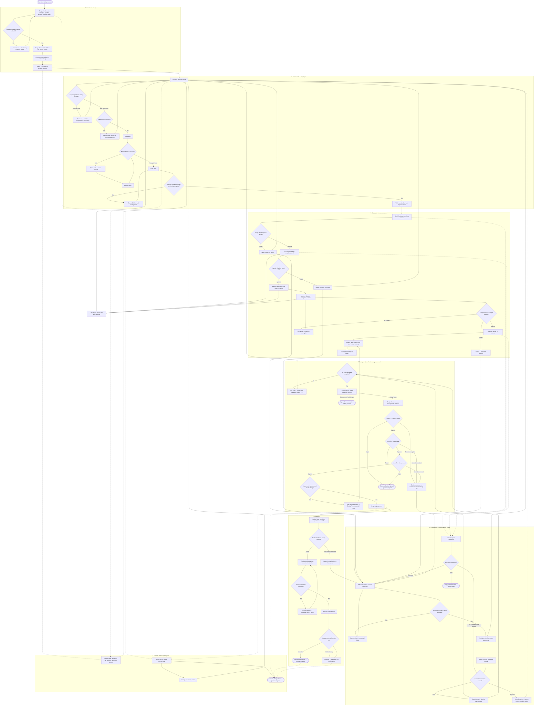

# Design-to-Production Journey

Non-technical end-to-end business flow for Decent ERP design operations — from creating a concept through production release and going live.

**Audience:** Product Managers, Designers, QA, and business stakeholders.

**Out of critical path (monitoring only):** Live Team Time and KPI dashboards do not gate this journey; they help supervisors watch activity and performance.

---

## Role legend

| Role | What they do in this journey |
| --- | --- |
| **Design Head** | Creates the concept, assigns people, approves sketch / final stages, requests management sign-off, sends the design to production, may send to a QC phase or jump a stage when authorized |
| **Sketch Designer** | Draws / completes the sketch; fixes sketch rework from corrections |
| **Punching Designer** | Digitizes / punches the design; common target for rework |
| **Machine Operator** | Runs the machine sample |
| **Sample Checker** | Checks punch and sample (approve, reject, or re-sample); first level of management sign-off |
| **Costing Team** | Enters development / standard costs (required before final management approve) |
| **Production Head** | Accepts handoff, writes instruction, releases to production, or returns for clarification |
| **Management** | Final level of management sign-off; reviews released designs and marks them live |

Anyone with correction permission (typically Design Head, Sketch / Punching Designer, Sample Checker) can raise a correction during quality loops.

---

## End-to-end business flow

### How to read this diagram

1. **Happy path:** Create → sketch → punch → material/fabric → sample → costing → request sign-off → three approval levels → production handoff → accept → instruction → release → live.
2. **Loops:** Hold/resume, invalid inputs, corrections, re-sample, stage returns, and production return all send work back to an earlier step — they are not dead ends.
3. **Terminal outcomes:**
   - **Design live** — success
   - **Design rejected** — stopped at management (or stage) reject
   - **Design closed** — intentionally closed
   - **Approvals / corrections empty** — nothing to do right now (refresh when work arrives)
   - **Released — waiting live** — temporary; Management can still mark live

---

## QA Test Flow

Use this as an end-to-end testing checklist. Each row maps a decision or path from the diagram to what should be verified.

### 1. Create and set up

| Path / condition | What to test |
| --- | --- |
| Required details incomplete or invalid | Save is blocked; clear message; user can fix and save successfully |
| Valid concept create | Concept saves; stage checklist appears from the workflow pattern |
| Concept review | Concept review advances; sketch becomes the next actionable work |
| Sketch assignment | Sketch Designer sees the sketch in My Work (or Design Head can assign if needed) |

### 2. Do the work (any stage)

| Path / condition | What to test |
| --- | --- |
| Empty My Work | Empty state shown; no crash; work appears after assign or prior stage completes |
| Unassigned ready work | Executor cannot start; Design Head assigns/reassigns; then start is allowed |
| Start work | Work moves to in-progress; timer/activity is visible to the assignee |
| Hold without reason | Hold is blocked until a reason is chosen |
| Hold with reason → resume | Work pauses, then continues on the same item after resume |
| Finish without remark | Finish blocked |
| Finish without required file (when the stage requires a file) | Finish blocked until file is attached |
| Finish without sample outcome (sample check) | Finish blocked until Approve / Reject / Re-sample is chosen |
| Finish with incomplete sample checklist when approving | Approve path blocked or notes required per checklist rules |
| Valid finish | Work submits; next stage or review unlocks as expected |

### 3. Stage path — approvals and sample outcomes

| Path / condition | What to test |
| --- | --- |
| Sketch approve | Punching (or next) stage becomes available |
| Sketch return | Sketch owner can rework; pipeline does not silently skip ahead |
| Punch approve | Material / fabric (or next) stages can proceed |
| Punch return | Punching rework is required before continuing |
| Material and fabric complete | Machine sample becomes ready |
| Sample — Approve | Costing / later stages can proceed |
| Sample — Reject | Correction path opens; design does not pretend sample passed |
| Sample — Re-sample | Machine Operator gets sample work again; checker waits for new sample |
| Costing entry + finish | Costs visible on the design; final approval readiness can progress |

### 4. Corrections

| Path / condition | What to test |
| --- | --- |
| Open Corrections with nothing open | Empty messaging; no crash |
| Open Corrections with items | User can track, close as Done/Rejected, or raise a new correction |
| Raise without reason or route-to stage | Raise blocked; user prompted for required fields |
| Valid raise | Correction opens; routed stage owner sees rework; source work reflects correction needed |
| Rework complete → mark Done | Correction closes; pipeline can continue / next gates unlock |
| Mark correction Rejected | Source work restored for action; design does not stay stuck without an owner |
| Raise from sketch/punch/sample return paths | Same correction behavior from each quality return entry point |

### 5. Ready for sign-off and management chain

| Path / condition | What to test |
| --- | --- |
| Stages incomplete | Design does **not** appear as ready for sign-off |
| Stages complete | Design appears under Ready for sign-off for Design Head |
| Empty approvals queue | Empty state for users with nothing pending at their level |
| Request management approval | Design enters the sign-off chain; Level 1 (Sample Checker) can act |
| Level 1 Approve | Advances to Design Head level |
| Level 1 Correction required | Design reopens; correction path available; chain does not complete |
| Level 1 Reject | Design rejected — journey stopped; no production handoff |
| Level 2 Approve / Correction / Reject | Same three outcomes; approve advances to Management |
| Level 3 Approve **without** costs | Final approve blocked; message to add costs first |
| Level 3 Approve **with** costs | Design fully approved; production handoff becomes available |
| Level 3 Correction / Reject | Reopen via correction, or stop as rejected |
| After cost block → add costs → approve again | Retry succeeds once costs exist |

### 6. Production

| Path / condition | What to test |
| --- | --- |
| Production handoff by Design Head | Production Head sees design ready for acceptance |
| Accept handoff | Instruction / next production steps unlock |
| Return for clarification | Design routes back with reason; history preserved; correction/clarification path available |
| Instruction incomplete / release checklist incomplete | Release blocked with clear missing items |
| Valid release | Design released to production; Management live review becomes available |
| Live review — still reviewing | Design stays released / pending live; can mark live later |
| Mark live | Terminal success — design is live |

### 7. Alternate and exception paths

| Path / condition | What to test |
| --- | --- |
| Design Head send to QC / bypass phase (authorized) | Design lands on the chosen phase; assignees can continue from there |
| Unauthorized user attempts QC send/bypass | Action not available or blocked |
| Design on hold → resume | Work can continue after resume |
| Close design from applicable states | Design closed — journey stopped; no further pipeline actions |
| Rejected design | No production handoff; optional close remains a business outcome |
| Notifications (if enabled) | Relevant roles get notified on assignment, correction, approval request, production return |

### Suggested happy-path smoke (single design)

1. Design Head creates concept → sketch assigned  
2. Sketch Designer finishes sketch → Design Head approves  
3. Punching Designer finishes punch → Sample Checker approves punch  
4. Material / fabric stages complete → Machine Operator finishes sample  
5. Sample Checker approves sample  
6. Costing Team enters costs and finishes costing  
7. Design Head requests management approval  
8. Sample Checker → Design Head → Management all approve (costs already present)  
9. Design Head production handoff → Production Head accepts → instruction → release  
10. Management marks live  

### Suggested negative / loop smoke

1. Sample check **Re-sample** then approve on second pass  
2. Sample check **Reject** → raise correction → rework → mark Done → continue  
3. Management **Correction required** → fix → request approval again → full chain approve  
4. Final approve **without costs** → blocked → add costs → approve  
5. Production **return for clarification** → resolve → accept again → release → live  

---

## Notes for QA and PM

- Prefer business language in bug reports (“Sample re-sample did not return work to Machine Operator”) over technical status codes.
- Empty states (My Work, Approvals, Corrections) are expected outcomes, not failures, when there is genuinely no work.
- Time tracking and KPI screens are supporting views; they should not be required to complete this journey.
